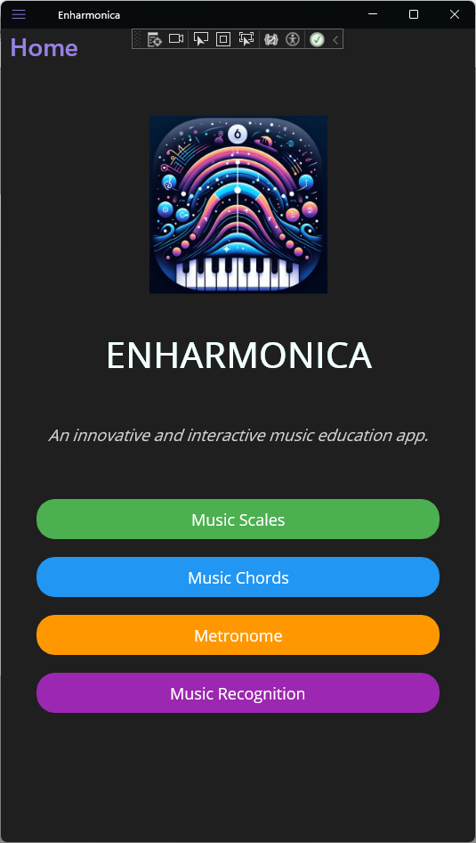
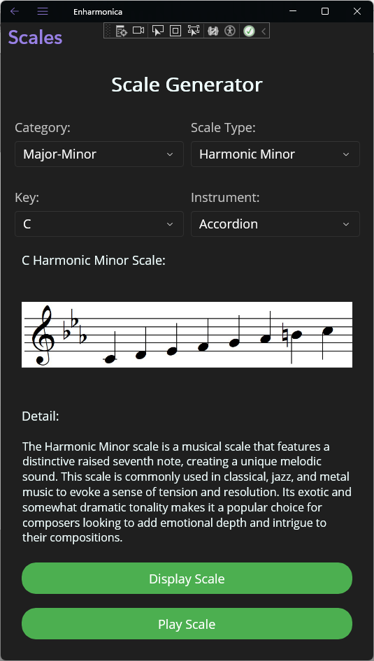
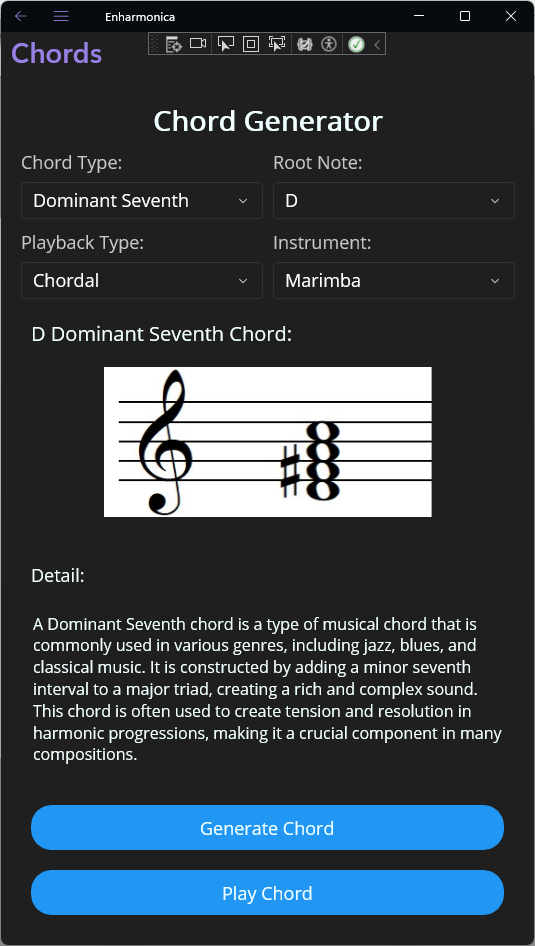
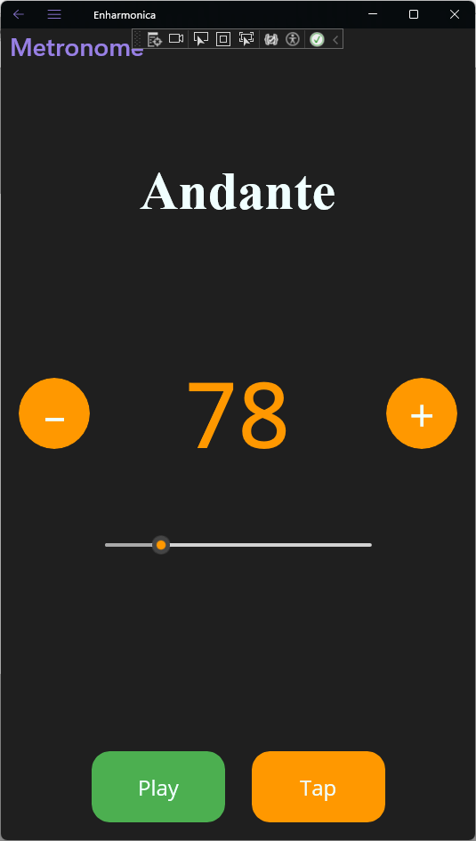
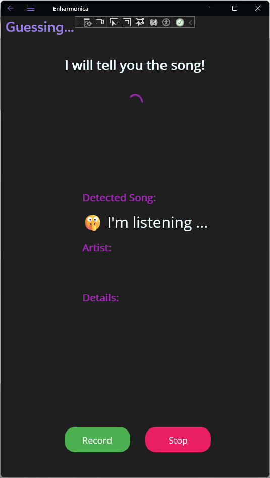
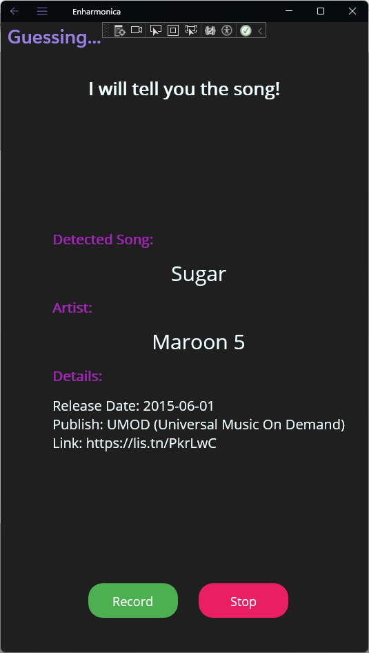
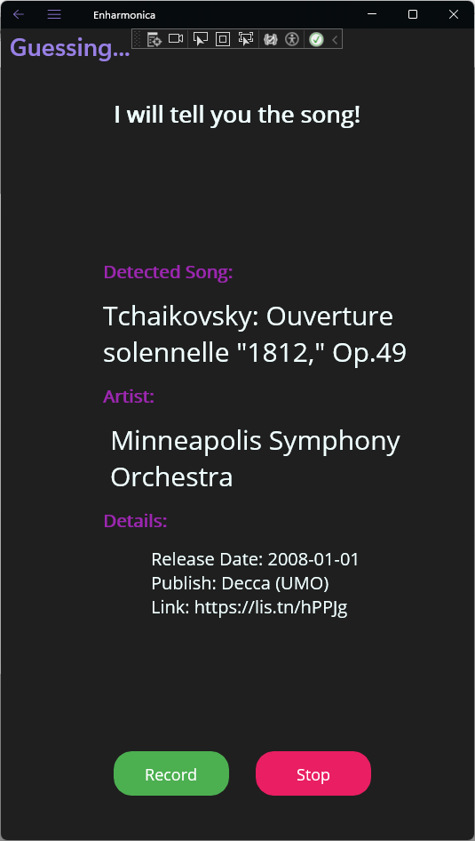

# 🎵 Enharmonica  

**An innovative and interactive music education app.**  
Enharmonica is a cross-platform music education tool that helps musicians generate musical scales, chords, and rhythm using AI-powered explanations and advanced sound analysis.

---

## 🚀 Features  

✅ **Interactive Scale & Chord Generator** – Instantly generate musical scales and chords with dynamic visuals.  
✅ **AI-Driven Explanations** – Integrates **Azure OpenAI** for real-time musical theory insights.
✅ **Built-in Metronome** – Adjustable tempo and beat tracking to enhance rhythm training. 
✅ **Advanced Pitch Detection** – Recognizes and analyzes musical notes for real-time feedback.  
✅ **Cross-Platform Compatibility** – Developed using **.NET MAUI**, ensuring seamless functionality across devices.  

---

## 🎬 Screenshots  

Here’s a preview of Enharmonica in action:  

 
 
  
 
 
 

---

## 🔧 Technologies  

- **.NET MAUI** – Cross-platform development  
- **Azure OpenAI** – AI-driven explanations  
- **Advanced Audio Processing** – audio recording & sound analysis  
- **Responsive UI/UX** – Interactive sliders, animations, and real-time feedback  

---

## 🛠 Installation  

### **Requirements**
- .NET MAUI installed  
- Azure OpenAI API key
- AudD API Key
- Visual Studio 2022  

